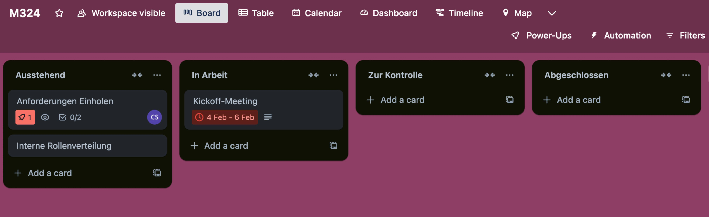

# M324Portfolio

# Inhaltsverzeichnis

- [Ausgangslage](#ausgangslage)
- [Versionsverwaltung](#versionsverwaltung)
- [Planung](#planung)
- [Code](#code)
- [Build](#build)

# Ausgangslage
Wir haben uns von ChatGPT eine kleine ToDo Liste App, welche nur aus einem HTML File besteht, aber trotzdem die Basisfunktionen besitzt. 
Man hat ein Eingabefeld, wo man Todo's eingeben kann und am unteren Ende wird dann dieses Todo eingefügt. Man kann das ToDo wieder löschen sobald man es erledigt hat.
Logischerweise ist diese App noch ausbaufähig und deswegen wollen wir das Design überarbeiten. Nämlich stimmen noch einige grössen der Buttons noch nicht und die App ist auch nicht
auf dem Handy gut nutzbar. Deswegen wollen wir einen Sprint machen, wo wir genau diese Issue tackeln. 

Hier ist noch der Source Code dieser einfachen Applikation:

```html
<!DOCTYPE html>
<html lang="de">
<head>
    <meta charset="UTF-8">
    <meta name="viewport" content="width=device-width, initial-scale=1.0">
    <title>To-Do Liste</title>
    <style>
        body {
            font-family: Arial, sans-serif;
            display: flex;
            justify-content: center;
            align-items: center;
            height: 100vh;
            background-color: #f4f4f4;
        }
        .container {
            background: white;
            padding: 20px;
            border-radius: 8px;
            box-shadow: 0 0 10px rgba(0, 0, 0, 0.1);
            width: 300px;
            text-align: center;
        }
        input {
            width: calc(100% - 22px);
            padding: 8px;
            margin-bottom: 10px;
            border: 1px solid #ccc;
            border-radius: 4px;
        }
        button {
            width: 100%;
            padding: 8px;
            background: #28a745;
            color: white;
            border: none;
            border-radius: 4px;
            cursor: pointer;
        }
        ul {
            list-style: none;
            padding: 0;
        }
        li {
            background: #ddd;
            margin: 5px 0;
            padding: 8px;
            display: flex;
            justify-content: space-between;
            border-radius: 4px;
        }
        .delete {
            background: red;
            color: white;
            border: none;
            padding: 5px;
            cursor: pointer;
            border-radius: 4px;
        }
    </style>
</head>
<body>
<div class="container">
    <h2>To-Do Liste</h2>
    <input type="text" id="taskInput" placeholder="Neue Aufgabe...">
    <button onclick="addTask()">Hinzufügen</button>
    <ul id="taskList"></ul>
</div>

<script>
    function addTask() {
        let taskInput = document.getElementById("taskInput");
        let taskList = document.getElementById("taskList");

        if (taskInput.value.trim() === "") return;

        let li = document.createElement("li");
        li.innerHTML = `${taskInput.value} <button class='delete' onclick='removeTask(this)'>X</button>`;
        taskList.appendChild(li);
        taskInput.value = "";
    }

    function removeTask(button) {
        button.parentElement.remove();
    }
</script>
</body>
</html>


```


# Versionsverwaltung

Man nutzt Versionsverwaltungen um Codestände zu speichern und auf keinen Fall den Code zu verlieren. Falls mal jemand ein Feature einbaut
welches die ganze Applikation lahm legt, kann man relativ schnell und einfach wieder auf einen älteren funktionalen Stand zurückgehen.
Der Branchenstandard für Versionsverwaltungen ist Git.


# Planung


## Kurzbeschreibung der verwendeten Apps/Tools:
Trello ist ebenfalls ein Tool von Atlassian, welches jedoch neben den kostenpflichtigen Varianten eine kostenlose anbietet. Diese beinhaltet wie die kostenpflichtige Variante Automatisierung und Boards, ist jedoch nur für Teams bis zu zehn Personen nutzbar und hat nicht alle Ansichten, die die premium Version bietet.
## Begründung der Wahl dieser Tools:
Wir haben uns für Trello entschieden, da das Tool relativ übersichtlich und schlank aussieht. Uns hat interessiert ob so ein schlankes Tool die nötigen Anforderungen erfüllen kann.
Wir hatten noch Klipfolio und Confluence im Auge aber entweder haben die Tools keine kostenfreie Version oder wir verwenden die Tools bereits in unseren Betrieb. 

## Erfahrungen mit den gewählten Tools:
Wir haben eine positive Erfahrung mit Trello gemacht. Es ist ein Tool, welches relativ schlank ist aber genug an Features bietet. Aus unserer Sicht es perfekt geeignet für den persönlichen Gebrauch 
oder in kleinen Teams. Für grosse Teams hat es ein wenig zu wenig Features bzw. wird dann mit der Zeit ein wenig zu unübersichtlich. 
Das generelle Feeling und arbeiten mit dem Tool war sehr angenehm und intuitiv. Wir konnten sehr schnell ein Board erstellen und auch darauf Items platzieren und diese dann auch herumschieben. Wir fanden vor allem das Feature dass man Items Zeitlich begrenzen kann und sie dann auch in einer Kalenderansicht anschauen kann. 
So kann man schnell ansehen welche Items wann fällig sind. 
## Reflexion:
Die generellen Grundfunktionen laufen in diesem Tool einwandfrei. Die Bedienung des Boards ist einfach und funktioniert einwandfrei. Es fehlt uns aber ein wenig an zusätzlichen Funktionen. Z. B. kann man nicht richtig in Sprints und nach allgemeinen Scrum Prinzipien arbeiten. Diese Dinge müsste man separat managen. Ausserdem kann man 
auch nicht richtig die Ressourcen managen bzw. Grafiken wie Burn Down Charts etc. generieren lassen. 
Unsere Erkenntnis ist, dass Trello für kleine Teams gut einsetzbar ist wo 3-5 Leute miteinander arbeiten. Sobald aber dann noch Product Owner von aussen und viele Stakeholder dazukommen wird das Tool sehr schnell unübersichtlich und wir denken dass dann ein Jira besser geeignet wäre.
Wir sehen aber auch das Potenzial Trello als persönliches Aufgabentracking, sei es Privat oder Geschäftlich, hat. Man kann sehr schnell und einfach dort seine Aufgaben erfassen und einen Überblick zu behalten. Mit der Kalenderfunktion kann man es noch Zeitlich begrenzen. 
## Alternative Tools:
Jira: Branchenstandard und hat eine Gratisversion. Da es aber so populär ist, wollten wir etwas anderes ausprobieren um unseren Horizont zu erweitern.
Azure DevOps: Auch relativ weit verbreitet und Cyrill kennt bereits das Tool weswegen wir uns dagegen entschieden haben, da wir beide ein neues Tool kennenlernen wollten. 
Monday.com: Hat ebenfalls eine kostenlose Version, aber da uns die Werbung von ihnen früher auf die nerven ging und Trello den lustigeren Namen hatte, haben wir uns gegen Monday entschieden. 
## Nachweise:



# Code

## Semantic Versioning
Unter semantic Versioning (kurz SemVer) versteht man die Versionierung mittels
Major.Minor.Patch (z.B. 1.2.0).
Was diese Begriffe bedeuten findet man auf semver.org:
MAJOR wird erhöht, wenn API-inkompatible Änderungen veröffentlicht werden
MINOR wird erhöht, wenn neue Funktionalitäten, die kompatibel zur bisherigen API sind, veröffentlicht werden,
PATCH wird erhöht, wenn die Änderungen ausschließlich API-kompatible Bugfixes umfassen.

## Conventional Commits
Conventional Commits sind ein Leitfaden, um verständliche und einheitliche Commit Messages zu schreiben.
Der empfohlene Aufbau ist wie folgt:

```
<type>[optional scope]: <description>
[optional body]
[optional footer(s)]
```

Es gibt zwei Typen, Fix, welcher einen Bug fixed und im Bezug auf SemVer den Patch erhöht
und Feat, also kurz für Feature, was einen Minor change darstellt.
Andere empfohlene Typen sind build:, chore:, ci:, docs:, style:, refactor:, perf:, test:

In dieser Phase erweitern wir unsere ToDo App, damit der Nutzer eine Beschreibung bei den Aufgaben hinzufügen kann.
Nachfolgend die veränderten Codeausschnitte.

Hinzufügen eines zweiten Eingabefelds:
```html
<!-- Einfügen eines zweiten Eingabefeld -->
<input type="text" id="descInput" placeholder="Beschreibung...">
```

Hinzufügen eines Klick Events, welches bei draufklicken eines Items die Beschreibung mit anzeigt.
```javascript
let descInput = document.getElementById("descInput");  

<li.innerHTML = 
    <div class='task-header' onclick='toggleDescription(this)'>
        <span>${taskInput.value}</span>
        <button class='delete' onclick='removeTask(event, this)'>X</button>
    </div>
    <div class='description'>${descInput.value}</div>
;
descInput.value = "";
```

Styling der hinzugefügten Elemente
```css
.task-header {
    display: flex;
    justify-content: space-between;
    align-items: center;
    cursor: pointer;
}
.description {
    display: none;
    margin-top: 5px;
    background: #f9f9f9;
    padding: 5px;
    border-radius: 4px;
    font-size: 0.9em;
}
```

Nach diesen Änderungen sieht der vollständige Code wiefolgt aus:
````html
<!DOCTYPE html>
<html lang="de">
<head>
    <meta charset="UTF-8">
    <meta name="viewport" content="width=device-width, initial-scale=1.0">
    <title>To-Do Liste</title>
    <style>
        body {
            font-family: Arial, sans-serif;
            display: flex;
            justify-content: center;
            align-items: center;
            height: 100vh;
            background-color: #f4f4f4;
        }
        .container {
            background: white;
            padding: 20px;
            border-radius: 8px;
            box-shadow: 0 0 10px rgba(0, 0, 0, 0.1);
            width: 300px;
            text-align: center;
        }
        input {
            width: calc(100% - 22px);
            padding: 8px;
            margin-bottom: 10px;
            border: 1px solid #ccc;
            border-radius: 4px;
        }
        button {
            width: 100%;
            padding: 8px;
            background: #28a745;
            color: white;
            border: none;
            border-radius: 4px;
            cursor: pointer;
        }
        ul {
            list-style: none;
            padding: 0;
        }
        li {
            background: #ddd;
            margin: 5px 0;
            padding: 8px;
            display: flex;
            flex-direction: column;
            border-radius: 4px;
        }
        .task-header {
            display: flex;
            justify-content: space-between;
            align-items: center;
            cursor: pointer;
        }
        .description {
            display: none;
            margin-top: 5px;
            background: #f9f9f9;
            padding: 5px;
            border-radius: 4px;
            font-size: 0.9em;
        }
        .delete {
            background: red;
            color: white;
            border: none;
            padding: 5px;
            cursor: pointer;
            border-radius: 4px;
        }
    </style>
</head>
<body>
<div class="container">
    <h2>To-Do Liste</h2>
    <input type="text" id="taskInput" placeholder="Neue Aufgabe...">
    <input type="text" id="descInput" placeholder="Beschreibung...">
    <button onclick="addTask()">Hinzufügen</button>
    <ul id="taskList"></ul>
</div>

<script>
    function addTask() {
        let taskInput = document.getElementById("taskInput");
        let descInput = document.getElementById("descInput");
        let taskList = document.getElementById("taskList");

        if (taskInput.value.trim() === "") return;

        let li = document.createElement("li");
        li.innerHTML = `
                <div class='task-header' onclick='toggleDescription(this)'>
                    <span>${taskInput.value}</span>
                    <button class='delete' onclick='removeTask(event, this)'>X</button>
                </div>
                <div class='description'>${descInput.value}</div>
            `;
        taskList.appendChild(li);
        taskInput.value = "";
        descInput.value = "";
    }

    function removeTask(event, button) {
        event.stopPropagation();
        button.closest("li").remove();
    }

    function toggleDescription(element) {
        let description = element.nextElementSibling;
        if (description.style.display === "block") {
            description.style.display = "none";
        } else {
            description.style.display = "block";
        }
    }
</script>
</body>
</html>

````


## Verwendete Apps/Tools
Die Programmierung mit HTML/CSS/JS erledigten wir in Visual Studio Code und die Versionierung mittels Github.
Wir haben uns für diese Tools entschieden, da wir VSCode bereits installiert hatten sowie unser Portfolio bereits in Github verwalten
Bei der Versionierung und Commits halten wir uns an die bereits erläuterten Standards.

## Erfahrungen mit den gewählten Tools
Die Arbeit verlief gut, da wir beide uns mit den gewählten Tools bereits auskennen. Larissa hatte jedoch ihre Mühe mit dem Committen in VSCode selbst, da sie in der Firma mit TortoiseGit arbeitet.
Ebenfalls gibt es in unserer App stand jetzt noch keinen visuellen Indikator dafür, dass man die ToDos aufklappen kann, um die Beschreibung anzuzeigen.

## Reflexion
VSCode ist für die Webentwicklung gut nutzbar, jedoch muss man sich informieren über brauchbare Extensions, um wie in IDEs mit Vervollständigungen und Korrekturen arbeiten zu können.
Github ist und bleibt eine der besten Versionsverwaltungen, mit welcher wir keinerlei Probleme hatten bis auf einen altbekannten Merge Conflict, welcher aber einfach zu lösen war.

## Alternative Tools
Programmierumgebungen beziehungsweise Editoren für die Webentwicklung gibt es wie Sand am Meer. Eine davon ist JetBrains Webstorm. Wie oben erwähnt haben wir uns jedoch für VSCode entschieden, damit wir nicht alles neu einrichten müssen.
Neben Github beziehungsweise Git allgemein gäbe es noch Subversion, welches aber den Nachteil hat, dass Dateien nicht simultan von mehreren Benutzern bearbeitet werden können.
Da wir dies jedoch machen wollten, schied Subversion von Anfang an bereits aus.


# Build
## Kurzbeschreibung der verwendeten Apps/Tools:
Wir haben für die Phase Build Github bzw. Github Pages und Github Actions verwendet. Mit Github Pages kann man sehr schnell und einfach seine HTML Seite über
Github hosten. So kann man sehr einfach auch die Website auch auf dem Handy, Tablet oder anderen Geräten aufrufen und selbst testen. 
Mit Github Actions kann man selber Pipelines definieren. Z. B. kann man eine Pipeline konfigurieren, welche bei jedem Commit auf einen bestimmten Branch gewisse Jobs ausführt. Z. B. kann man einen Job
definieren, welche versucht die Applikation zu builden, oder die Unittests ausführt und noch vieles mehr. 

## Begründung der Wahl dieser Tools:
Wir haben uns für Github Pages und Actions entschieden, weil es Teil der vorigen Aufgaben war und wir es für nicht besonders sinnvoll hielten, jetzt noch ein komplett anderes Tool zu verwenden. Vorallem eignet sich Github sowieso für solche Dinge, da es im Gegensatzu zu Gitlab
direkt nutzbar ist ohne grosse Konfiguration. Ausserdem war Github Pages und Actions sowieso für uns beide neu also sahen wir es als ideale Möglichkeit uns noch mehr darin zu vertiefen.
## Erfahrungen mit den gewählten Tools:
Wir haben haben und vorgenommen eine GitHub Action zu definiere, welche sobald ein neuer Commit auf dem main branch gemacht wird, die Applikation gleich auf der GitHub Page deployt. 
Zu aller erst haben wir eine GitHub Page erstellt. Das ging ganz einach bei Github unter *Settings > Pages*. Dort habe ich dann *Deploy from branch* und dann den main branch ausgewählt.
Und schon lief unsere Applikation auf einer GitHub Page. 
Für die Action erstellte ich einen Ordner Namens: *.github/workflows* und erstellte die Datei *main.yml*. In dieser Yaml Datei füge ich folgenden Code hinzu:

```yaml
name: Deploy HTML to GitHub Pages

on:
  push:
    branches:
      - main  # Deployment wird ausgelöst, wenn auf main gepusht wird

permissions:
  contents: read
  pages: write
  id-token: write

jobs:
  deploy:
    environment:
      name: github-pages
    runs-on: ubuntu-latest

    steps: # Definieren der einzelnen Schritte welche die Pipeline durchlaufen soll
      - name: Checkout Repository
        uses: actions/checkout@v4

      - name: Setup Pages
        uses: actions/configure-pages@v4

      - name: Upload Artifact
        uses: actions/upload-pages-artifact@v3
        with:
          path: .  # Stellt sicher, dass das HTML-Projekt hochgeladen wird

      - name: Deploy to GitHub Pages
        uses: actions/deploy-pages@v4

```
Sobald ich jetzt eine neue Version meiner App pushe wir diese Automatisch auf meine GitHub page deployt, sofern das Setup der Pages und uploaden der Artifacts funktioniert. Ansonsten wird die Pipeline abbgebrochen.
Allgemein waren unsere Erfahrungen überraschend positiv. Wir hätten uns das viel komplizierter vorgestellt. Wir hatten in einer knappen halben Stunde diese Pipeline + Page zusammen und können jetzt CI/CD betreiben.

## Reflexion:
Ganz allgemein ging diese Phase extrem gut vonstatten. Wir hatten kaum Schwierigkeiten und es lief alles wie am Schnürchen. Wir vertrödelten auch kaum Zeit, was auch daran liet, dass GitHub uns mit Pages und Actions eine sehr gut Möglichkeit biete soetwas umzusetzen.
Logischerweise haben wir hier eine sehr einfach Ausführung und man könnte es noch viel komplizierter erweitern, aber trotzdem haben wir extrem schnell das Grundgerüst erstellen können. 
Falls wir irgendwann mal wieder ein Projekt auf GitHub aufsetzen sollen, werden wir definitiv Actions konfigurieren um den Workflow zu verbessern und automatische Tests einzufügen. 
## Alternative Tools:
- Gitlab CI/CD: Das Pendant zu GitHub Actions von Gitlab. Das ist aber mehr limitiert im kostenlosen Plan wie Github Actions
- Jenkins: Eines der ältesten CI/CD Tools, welches sehr anpassbar und Open Source nutzbar ist. Leider ist es dafür sehr Wartungsintensiv. 
- Travis CI: Ist ein Cloudbasiertes CI/CD Tool, welches sehr beliebt war, aber an Bedeutung verloren hat. Es lässt sich sehr einfach konfigurieren und gut integrieren mit GitHub. Die Kommerzielle Version ist aber sehr teuer. 

## Nachweise:


